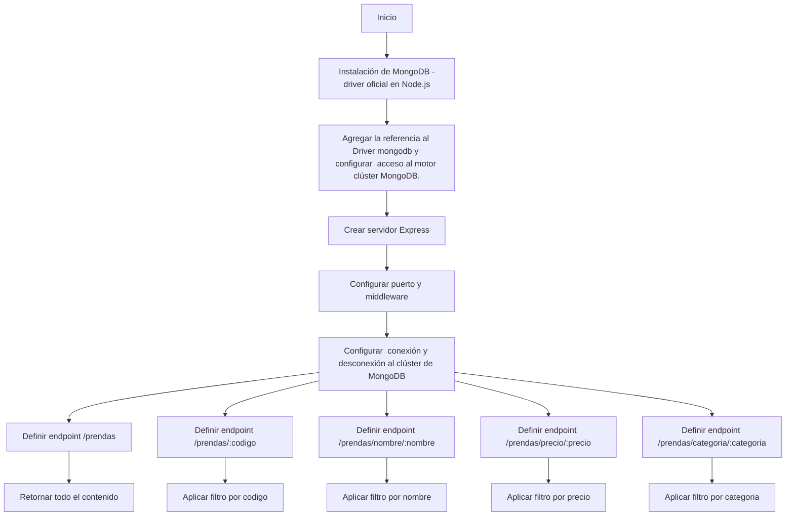
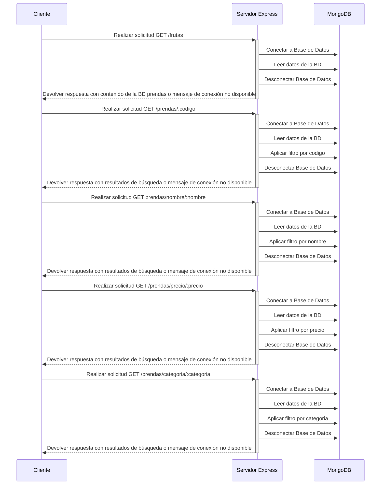

# App PRENDAS
La funcionalidad principal de esta app es contar con una Base de Datos llamada Mongodb, donde se podrán consultar nombre, precios y tipos de frutas disponibles

## Requisitos funcionales:
Instalar:
#### Node Js: https://nodejs.org/es
#### Base de datos MongoDB Compass: https://www.mongodb.com/products/tools/compass

## Dependencias a instalar:
En terminal de Visual Code, ejecutar comando:
```
npm i 
```
```
npm i dotenv express mongodb nodemon
```
## Ejecución del proyecto:
En terminal de Visual Code, ejecutar comando:
```
 node server.js
```
## Extension de Visual Code a instalar:
Thunder Client es una extensión liviana y sencilla que sirve para simular llamadas a las API


## Consulta a Base de Datos
#### Paso 1

#### Paso 2

#### Paso 3
##### Seleccionar el método para obtener los siguientes resultados:
##### 1. Obtener colección de prendas
###### . Metodo: GET
###### . Ruta: http://localhost:3000/prendas
###### . Descripción: `este endpoint retorna la colección de prendas`
###### . Ejemplo de la solicitud:


##### 2. Agregar una prenda
###### . Metodo: POST
###### . Ruta: http://localhost:3000/prendas
###### . Descripción: `este endpoint agrega una prenda a la colección`
###### . Ejemplo de la solicitud:


##### 3. Modificar una prenda
###### . Metodo: PUT
###### . Ruta: http://localhost:3000/prendas/:codigo
###### . Descripción: `este endpoint modifica la prenda con el codigo enviado como parámetro en la URL. En caso que exista, se muestra un mensaje de éxito en la modificación. Caso contrario, devuelve un mensaje de error`
###### . Ejemplo de la solicitud:


##### 3. Eliminar una prenda
###### . Metodo: DELETE
###### . Ruta: http://localhost:3000/prendas/:codigo
###### . Descripción: `este endpoint elimina la prenda con el codigo enviado como parámetro en la URL. En caso que exista, se muestra un mensaje de éxito en la eliminación. Caso contrario, devuelve un mensaje de error`
###### . Ejemplo de la solicitud:


## Resumen consulta a Base de Datos
| PETICION |  URL | DESCRIPCION |
|:--------:|-----|-------------|
|GET |[/prendas](/prendas)| Obtener todas las prendas| 
|GET |[/prendas/:codigo](/prendas)| Obtener todas las prendas por codigo| 
|GET |[/prendas/nombre/:nombre](/prendas)| Obtener prendas por nombre| 
|GET |[/prendas/precio/:precio](/prendas)| Obtener prendas por precio| 
|GET |[/prendas/categoria/:categoria](/prendas)| Obtener prendas por categoria| 

## Resumen métodos a Base de Datos
| PETICION |  URL | DESCRIPCION |
|:--------:|-----|-------------|
|GET |[/prendas](/prendas)| Obtener todas las prendas| 
|POST |[/prendas](/prendas)|Agregar una prenda| 
|PUT |[/prendas/:codigo](/prendas)| Modificar una prenda por codigo| 
|DELETE |[/prendas/:codigo](/prendas)| Eliminar una prenda por codigo| 

## Diagrama de Flujo

Un codigo de mermaid js de un diagrama de flujo de una app que permite consultar en una base de datos (MongoDB), codigo, nombre, precio y categoria de prendas.

### Mermaid


## Diagrama de Secuencia
### Mermaid


```
Este diagrama de secuencia representa las interacciones entre el cliente y el servidor Express para
cada uno de los endpoints mencionados en el flujo original. Cada solicitud del cliente al servidor
se procesa en el servidor Express y se devuelve una respuesta correspondiente al resultado de la consulta.
```